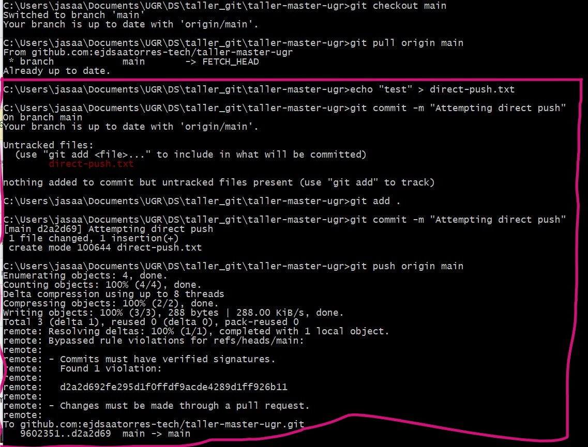
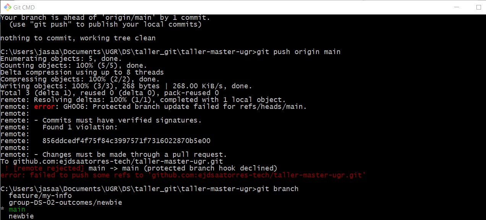
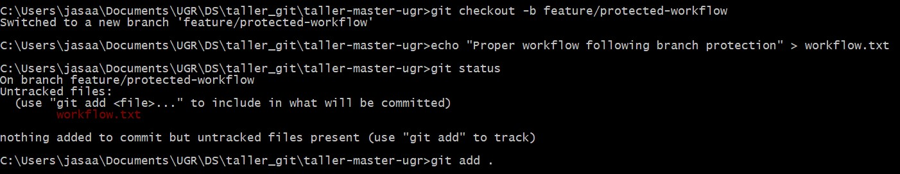
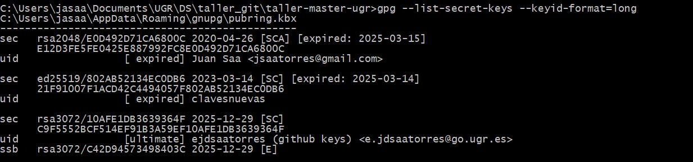
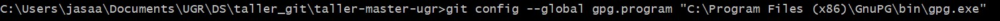
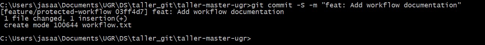
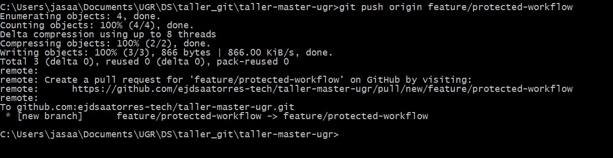
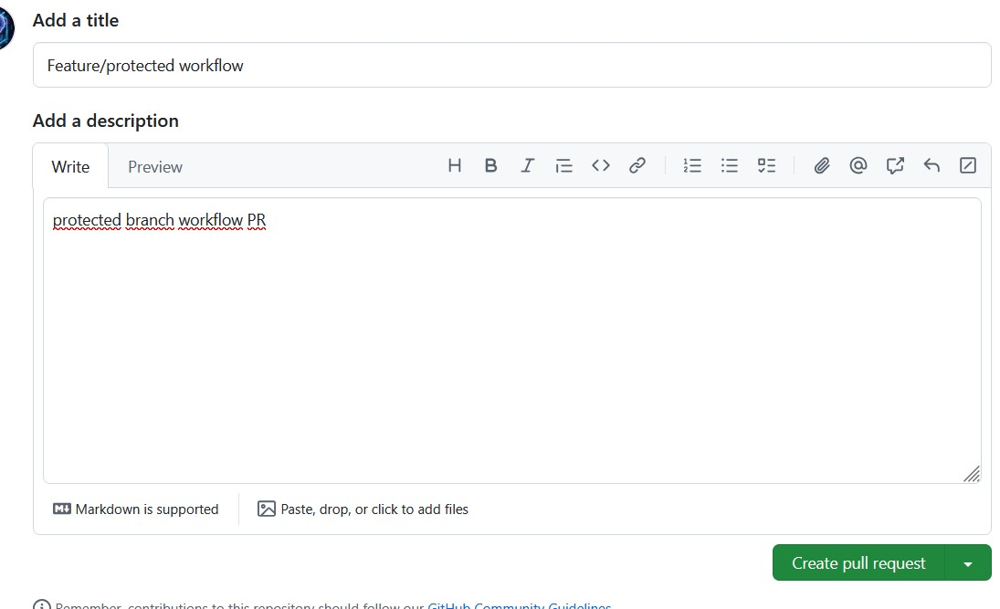
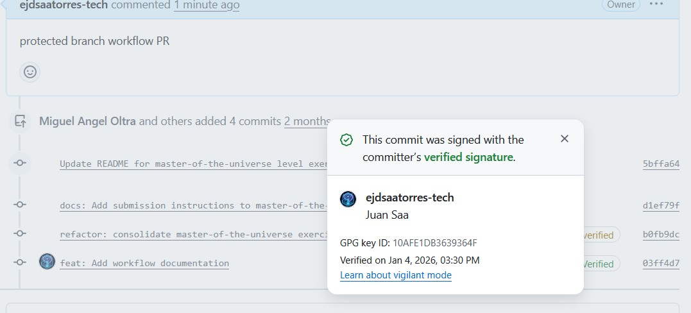
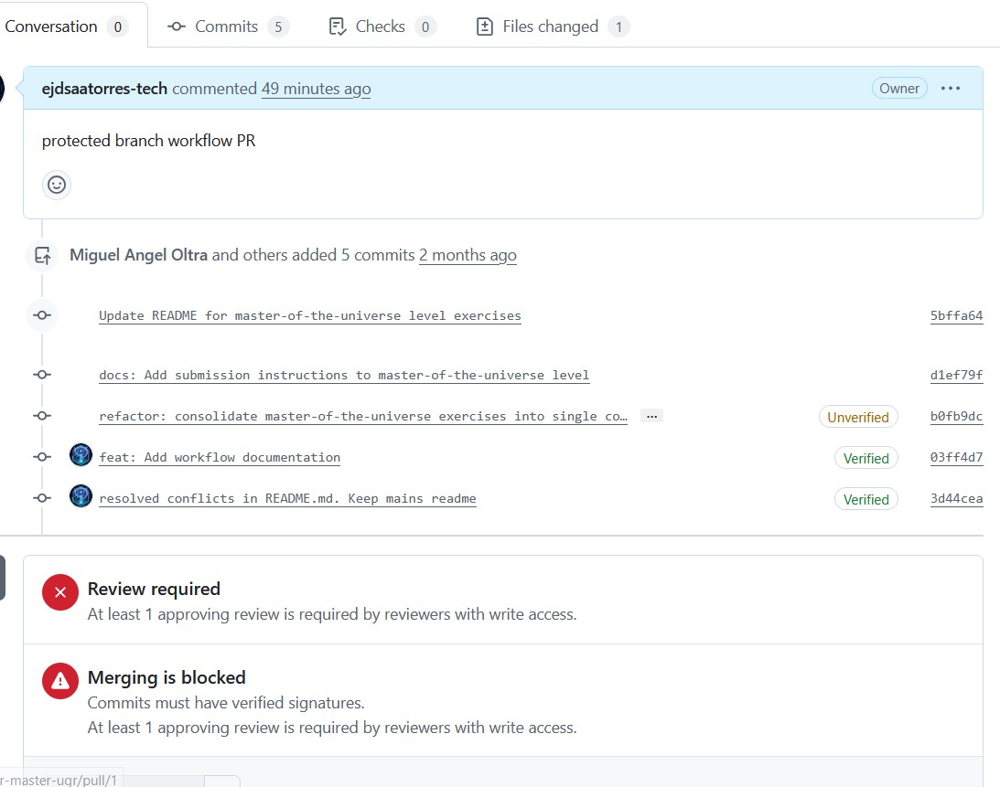

# Exercise Outcomes Submission Template

**Student/Group Name**: DS-02 
**Level Completed**: master-of-the-universe 
**Date**: 11/01/2026

---

## 📋 Exercise Summary

### Exercise: [Exercise Title]
**Status**: ✅ Completed

**What I did**:
En este ejercico se aplicó métodos para proteger los cambios realizados sobr ela rama main. Se implementó PR obligatorio y se requirió que los commits sean firmados criptográficamente con gpg. Se configuró la rama que los revisores aprueben los cambios hechos antes de aceptar un PR.

**Commands Used**:
```bash
git add
git commit -m
git commit -S -m
git status
git checkout -b
gpg --list-secret-keys
git config --global gpg.program "path-to-gpg.exe"
git push origin

# etc.
```

**Results/Output**:
```
Ver capturas a continuacion.
```

**Screenshots** (if applicable):
- 
- 
Creación de direct-push.txt e intento de push directo que falla.
- 
Creacion de la rama feature/protected-workflow y creación del archivo workfow.txt
- 
Visualización de las claves publicas/privadas gpg disponible
- 
Confgurar git para usar gpg para firmar los commits
- 
Firmado critpográfico del commit con gpg
- 
Push a la rama feature/protected-workflow
- 
Creación del PR en GitHub
- 
Confirmación de que el último commit fue firmado
- 
Push request a la espera de revision por los CODEOWNERS
---

## 🎯 Key Learnings

**Main concepts I learned**:
1. Usar ramas auxiliares para realizar cambios. (Siempre hacer un fetch antes para sincronizar con el remoto y resolver conflictos)
2. Usar claves criptográficas para firmar commits garantiza la autoría de los cambios.
3. Evitar hacer merge a la rama principal, main, prod, master. Usar PR desde una rama auxiliar ayuda a asegurar que los cambios sean seguros.
4. Se puede forzar la revisión de los cambios por parte de revisores autorizados de modo que no pasen a la rama principal desapercibidos.

**Skills I improved**:
- Ejercitar el hábito de hacer pull o fetch antes de crear una rama para tener el repo local sincronizado con el remoto
- Solventar conflictos entre ramas o entre remoto y local
- Manejar las llaves de gpg. Usar el GUI Kleopatra para administrar visualmente las claves o gpg desde la línea de comando
- Usar las opciones de GitHub para proteger ramas y repositorio. Crear y administrar PR.

---

## 🚧 Challenges Faced

### Challenge 1: [Brief title]
**Problem**: A veces surgieron discrepancias entre la rama local y la remota.

**Solution**: Se usó log y diff para localizar incongruencias y corregir las discrepancias.

**Commands/Approach**:
```bash
# Commands or approach used to solve the problem
git diff
#abrir el archivo en VC para ver las diferencias
```

---

## 💭 Personal Reflection

**What surprised me**:
No sabía que se posible (o necesario) firmar los commits

**What I found most difficult**:
Creo que lo más difícil es resolver conflictos entre ramas. Toma tiempo subsanar las diferencias y requiere conocer las herramientas de comparación de diff y log.

**What I found most useful**:
En cuanto a la firma critpográfica, me pareció muy interesante y potencialmente útil en un contexto profesional donde la seguridad es un factor decisivo. El trabajo por ramas protegidas y ramas auxiliares me parece lo más útil en el trabajo del día a día con control de versiónes.

**How I would apply this in real projects**:
En adelante, organizaré mis repos tratando de seguir la filosofía GitFlow: usar ramas protegidas y ramas auxuliares para desarrollar.

---

## 📊 Self-Assessment

Rate your confidence level for each topic (1-5, where 5 is very confident):

| Topic | Confidence (1-5) | Notes |
|-------|------------------|-------|
| Basic Git commands | [5 ] | |
| Branching & merging | [4 ] | |
| Remote operations | [4 ] | |
| Conflict resolution | [4 ] | |
| History rewriting | [3 ] | |
| Git hooks | [3 ] | |
| Security practices | [4 ] | |

---

## 🔗 Evidence/Artifacts

**Links to branches/commits**:
- Link to your outcome branch: `https://github.com/miguel-oltra/taller-master-ugr/tree/group-X-outcomes/[level]`
- Key commits demonstrating your work:
  - Commit hash: [Short description]
  - Commit hash: [Short description]

**Additional files created** (if any):
- File 1: [Description]
- File 2: [Description]

---

## ✅ Completion Checklist

Before submitting, ensure you have:
- [ ] Completed the exercise for your chosen level (including all parts)
- [ ] Documented all commands used with their outputs
- [ ] Described challenges and how you resolved them
- [ ] Provided a thoughtful reflection on your learning
- [ ] Self-assessed your confidence in each topic
- [ ] Pushed your outcome branch to the remote repository
- [ ] Created a Pull Request (if required by your instructor)

---

## 📝 Additional Comments

[Any additional thoughts, questions, or feedback about the exercises]

---

**Submission Date**: [Date]  
**Ready for Review**: ✅ Yes / ❌ No
