# Exercise Outcomes Submission Template

**Student/Group Name**: DS-02  
**Level Completed**: newbie  
**Date**: [26/12/2025]

---

## 📋 Exercise Summary

### Exercise: [Exercise Title]
**Status**: ✅ Completed

**What I did**:
Se clonó el repositorio público de los ejercicos y se clonó localmente para poder realizar cambios. Se usó los comandos básicos de gestión de git para añadir, commit, log y hacer push  y pull al remoto.

**Commands Used**:
```bash
# List the key Git commands you used across all parts of the exercise
git clone
git add
git commit
git checkout
git branch
git log
git push
git commit --amend
git push
git pull

```

**Results/Output**:
```
ver capturas abajo
```

**Screenshots** (if applicable):
- 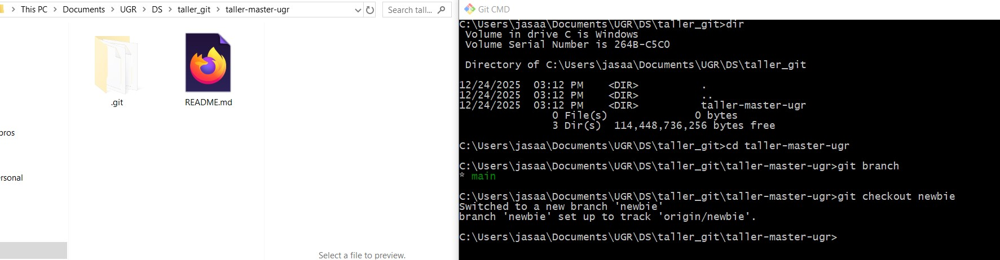
checkout newbie branch
- 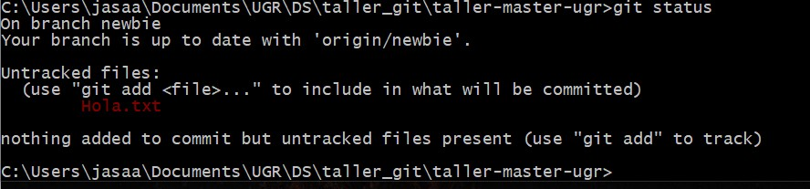
Hola.txt no esta siendo seguido
- 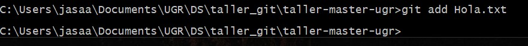
Añadiendo Hola.txt
- 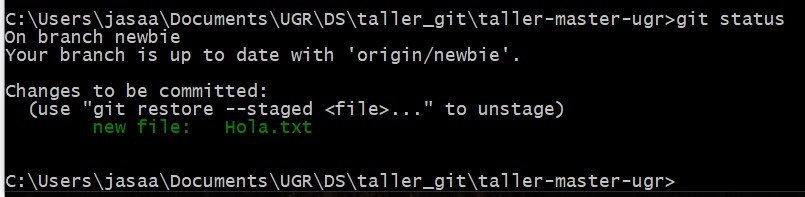
Estatus: Hola.txt está siendo seguido
- 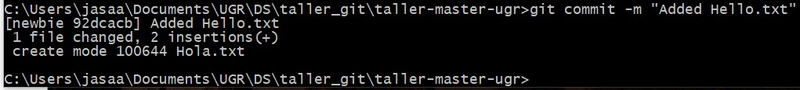
Commit de Hola.txt
- 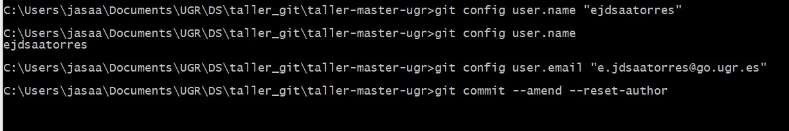
Cambio de usuario y correo y commit --amend
- 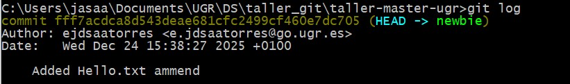
Log refleja el último commit
- 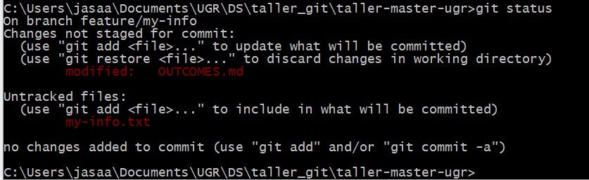
Estatus: OUTCOME.md modificada y my-info.txt sin seguimiento
- 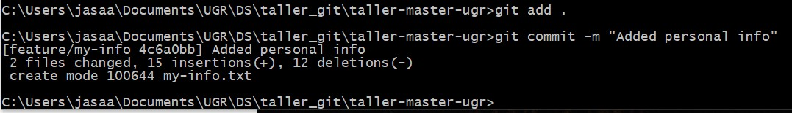
Añadir todo con git add . y commit
- 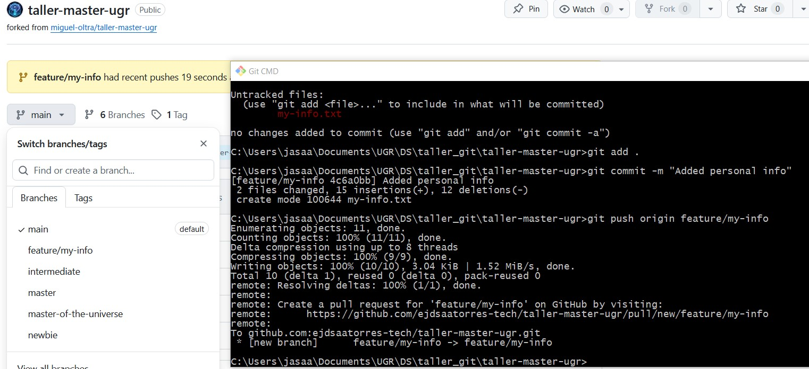
Push a la rama feature/my-info
- 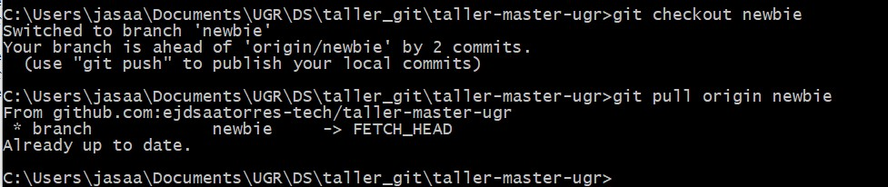
checkout rama newbie y pull de últimos cambios

---

## 🎯 Key Learnings

**Main concepts I learned**:
1. Hacer fork de un repositorio
2. Clonar localmente
3. Gestionar usuario e email
4. stage y commit nuevos archivos o cambios en archivos (tracking de nuevos archivos)
5. Mostrar logs para verificar cambios, p, ej. autor e email, fecha, etc.

**Skills I improved**:
- Discernir entre config local y config global para user.name y user.email (y otras configuraciones)
- 
---

## 🚧 Challenges Faced

### Challenge 1: [Brief title]
**Problem**: Olvidé cambiar user.name y user.email correcto (tengo varios usuarios y cuentas).

**Solution**:  Hice un amend para modificar el último commit.

**Commands/Approach**:
- git config user.name "myusername"
- git config user.email "myemail"
- git commit --amend --reset-author

---

## 💭 Personal Reflection

**What surprised me**:
[What unexpected things did you discover about Git?]
Hay diferentes niveles de configuracion: local, global, system. Puede resultar confuso si no se sabe la precedencia de las configuraciones.

**What I found most difficult**:
[Which concepts or exercises were most challenging?]
No encontré nada especialmente difícil. 

**What I found most useful**:
[Which skills do you think will be most valuable in real projects?]
Mantener un repositorio remoto (usando clone, push y pull) para poder compartir y colaborar con otras personas en un mismo proyecto.

**How I would apply this in real projects**:
[Describe how you might use these Git skills in professional work]
Por ejemplo, para distribuir el trabajo entre colaboradores que modifican distintas ramas y trabajan en diferentes features del proyecto.

---

## 📊 Self-Assessment

Rate your confidence level for each topic (1-5, where 5 is very confident):

| Topic | Confidence (1-5) | Notes |
|-------|------------------|-------|
| Basic Git commands | [5 ] | |
| Branching & merging | [4 ] | |
| Remote operations | [4 ] | |
| Conflict resolution | [2 ] | |
| History rewriting | [3 ] | |
| Git hooks | [1 ] | |
| Security practices | [2 ] | |

---

## 🔗 Evidence/Artifacts

**Links to branches/commits**:
- Link to your outcome branch: `https://github.com/ejdsaatorres-tech/taller-master-ugr/tree/group-DS-02-outcomes/newbie`
- Key commits demonstrating your work:
  - Commit hash: [Short description]
  - Commit hash: [Short description]

**Additional files created** (if any):
- File 1: [Description]
- File 2: [Description]

---

## ✅ Completion Checklist

Before submitting, ensure you have:
- [✅] Completed the exercise for your chosen level (including all parts)
- [✅] Documented all commands used with their outputs
- [✅] Described challenges and how you resolved them
- [✅] Provided a thoughtful reflection on your learning
- [✅] Self-assessed your confidence in each topic
- [✅] Pushed your outcome branch to the remote repository
- [✅] Created a Pull Request (if required by your instructor)

---

## 📝 Additional Comments

---

**Submission Date**: [26/12/2025]  
**Ready for Review**: ✅ Yes